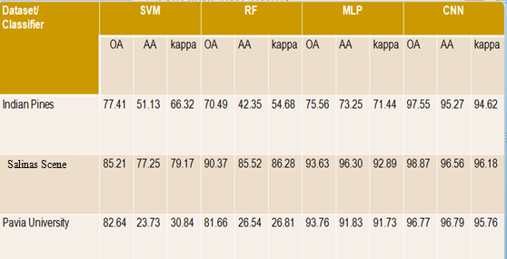

# A-Comaparative-Study-on-Hyperspectral-Image-Classification

  In this study, we performed classification on hyperspectral remote sensing dataset like Indian pines, Salinas secne and Pavia University. In order to perform classification we have used SVM classifier, Random Forest classifier from Machine Learning and MLP classifier, CNN classifier from Deep Learning. In this project, for performance evaluation of classification we calculated three metrics Overall Accuracy (OA), Average Accuracy (AA) and Kappa Coffiencent (kappa).
  
  In this project, we have written the code in python programming language. In order to perform this project you need to install packages mentioned below: Numpy, Pandas, Sklearn, Matplotlib, Scipy, Tensorflow, Keras, Spectral.
  
  In this project we written our code in jupyter notebook installed by using command "pip3 install jupyter".
  The table below contians the metric values obtained by classification of datasets.
  
  
  From the above comparsion table we observe Deep Learning methods have higher metric values.

  Datasets used in this project are downloaded from this website: http://www.ehu.eus/ccwintco/index.php/Hyperspectral_Remote_Sensing_Scenes
  
  
